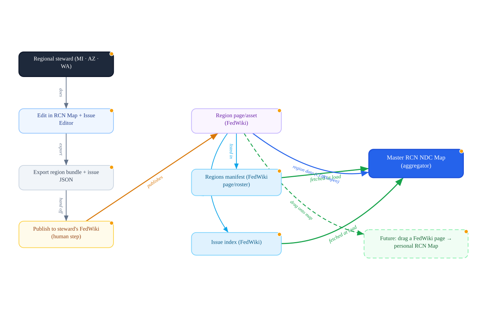

# RCN Region Federation — Spec

**Status:** loader built & verified 2026-07-23 · hosting convention still to decide
**Goal:** let regional stewards (Jerry / Michigan, Chris / Arizona, Marc / Washington, …) each own their region's polygons and issues on their **own FedWiki**, and have the master **RCN NDC Map** pull them all together automatically.

> **Implementation status:** the region-merge loader is **built into `rcn_map.html`** and verified in the browser (fetches a manifest, merges each bundle as read-only namespaced layers, adds a "Federated regions (read-only)" legend section, and skips unreachable regions gracefully). What remains is a network decision — *where* the manifest and region bundles are hosted on FedWiki (§3) — plus publishing each steward's first bundle.

---

## Flow



*Diagram source: `rcn-region-federation.graph.json` — open in `tools/graph-tool-v22.html` (IMPORT → JSON) to edit and re-export.*

---

## 1. Principle

Each steward owns one region. Ownership is **distributed** — nobody edits a shared master file. Each steward publishes their region to their own FedWiki site; the master map **aggregates** by reading a small manifest. This is FedWiki's federation model applied to map data: pages are served cross-origin by design, so the map can fetch any steward's region directly, with no proxy.

## 2. Two kinds of data

| Data | Produced in | Today | Under this spec |
|------|-------------|-------|-----------------|
| **Region bundle** — NDCs, boundary layers, custom locations, corrections | `rcn_map.html` → **⬇ Export my data** | localStorage only; no way back into the map | Published to the steward's FedWiki; pulled by the master map |
| **Issues** — parcels, stances, notes | `issue-polygon-map.html` → GeoJSON | hosted JSON listed in `issue-index.json` (via `localhost:8765` proxy) | Same index pattern, hosted on FedWiki |

The **region bundle is exactly the file the Export button already writes** (`rcn-map-data.json`): `{ type, exported, ndcs, locations, polygons, corrections }`. No new export format is needed — we add a small `region` / `steward` header.

## 3. Where data lives on FedWiki

Per steward, one region page (e.g. `region-arizona`) that carries the bundle. Two ways to hold it — pick one convention network-wide:

- **(A) Asset** — upload `az.json` as a page asset. Best for large GeoJSON (the page journal doesn't store every version of a big blob). *Confirm assets are served CORS-open on the host before committing to this.*
- **(B) Data item** — a single typed item (a data/code plugin) whose text is the bundle JSON. Keeps everything in the page + journal (versioned), best for smaller regions. Page JSON is guaranteed CORS-open by federation.

**Recommendation:** start with (B) data-item for simplicity and versioning; move a region to (A) asset if its bundle gets large.

## 4. The manifests

Two small lists, themselves FedWiki pages (so they federate and are human-readable):

```jsonc
// regions.json  — one entry per steward
[
  { "region": "MI", "steward": "Jerry", "url": "https://jerry.fedwiki.example/region-michigan.json" },
  { "region": "AZ", "steward": "Chris", "url": "https://chris.fedwiki.example/region-arizona.json" },
  { "region": "WA", "steward": "Marc",  "url": "https://marc.fedwiki.example/region-washington.json" }
]
```

`issue-index.json` keeps its current shape (`{key, label, ndc, url, map}`) — just hosted on FedWiki instead of the local proxy.

## 5. Aggregator behaviour (master map) — **built**

On load, `rcn_map.html` runs `loadRegions()` (after `showOverview()`):

1. Fetches the manifest at `REGIONS_URL` — defaults to `regions.json` beside the map, overridable with `?regions=<URL>` (used for testing and for pointing at a FedWiki-hosted manifest).
2. For each entry, fetches the bundle `url` and merges its NDCs / boundaries / locations into a persistent `federatedGroup` as **read-only overlay layers**, **namespaced by region** (layer ids `fed:<REGION>:poly:<i>`, `fed:<REGION>:loc:<i>`, `fed:<REGION>:ndc:<name>`), each popup tagged with the steward for attribution.
3. Adds a **"Federated regions (read-only)"** legend section (grouped per region, `region — steward`), fully wired into highlight/zoom like native layers.
4. **Degrades gracefully** — a region whose URL fails is skipped with a `console.warn`; the manifest being absent just means "no federated regions." One outage never breaks the map.
5. Keeps the viewer's own localStorage scratch edits **separate** from published regional layers (distinct groups + id namespaces), so personal additions never tangle with federated data.

Verified 2026-07-23: a two-entry manifest (one reachable AZ bundle, one dead URL) loaded the AZ region's NDC + boundary + location as read-only, legended, highlightable layers, and silently skipped the dead entry.

## 6. Steward workflow

1. Do the region's work in `rcn_map.html` (Add NDC / boundaries / locations / corrections) and its issues in `issue-polygon-map.html`.
2. **⬇ Export my data (JSON)** → `rcn-map-data.json`; export issue GeoJSON.
3. Publish to your FedWiki region page (asset upload or data item) — **this publish/sign step is the human's**, per standing practice.
4. Add/confirm your line in `regions.json` and your issues in `issue-index.json` (or hand them to whoever curates the manifests).
5. The master map shows your region on next load.

## 7. Conventions & guardrails

- **Namespacing** by region prevents id collisions when three bundles merge.
- **Attribution** — every federated feature carries its steward + region.
- **Schema validation** — a small validator (or a FedWiki data plugin that enforces the bundle shape) guards against hand-edit drift.
- **Size** — prefer an asset over an inline item once a bundle is large, to keep page journals lean.
- **Offline** — the bundled base map still works offline; federated regional layers require the network at load (cache is a later optimisation).

## 8. What's built vs. what remains

**Built** — the region-merge loader in `rcn_map.html` (`loadRegions` / `renderFederatedRegions` / `buildFederatedLegendHTML`), verified in the browser.

**Remains** — network/process, not code:
- Decide the hosting convention (§3) and confirm asset CORS if route (A).
- Stand up the shared `regions.json` (and move `issue-index.json` off `localhost:8765` onto FedWiki).
- Each steward publishes their first region bundle and adds their manifest line.

## 9. Open decisions

1. **Hosting convention:** data-item (B, versioned, simple) vs asset (A, better for big GeoJSON) — and confirm asset CORS on the host.
2. **Who curates the manifests** — self-serve edits by each steward, or one coordinator page.
3. **Naming** for region pages / manifest pages across the federation.

## 10. Future direction

Marc's vision (2026-07-23): rather than a fixed manifest, **drag a FedWiki page directly onto your own RCN Map** to pull that region/issue in on demand — a personal, composable map assembled from federation. The region-merge loader above is the groundwork: once the map can ingest a region bundle from a URL, accepting one by drag-drop from a wiki page is a small step.

---

*Files: `rcn-region-federation.graph.json` (diagram source, RCN Graph Tool) · `rcn-region-federation.svg` (exported diagram) · this spec.*
