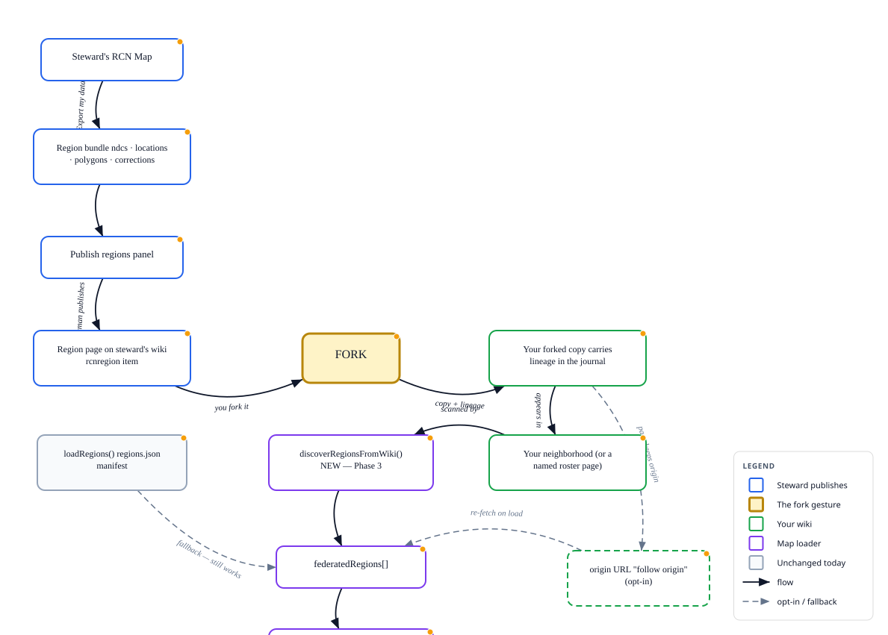

# RCN Region Federation via FedWiki Forking — Spec

**Status:** design proposal · 2026-07-25 · not built
**Builds on:** [`rcn-region-federation-spec.md`](rcn-region-federation-spec.md) (the manifest loader, built & verified 2026-07-23) and the **Publish regions** manifest-builder panel in `rcn_map.html` (built 2026-07-25).
**Goal:** replace the hand-maintained `regions.json` roster and out-of-band file-sharing with FedWiki's native **fork** gesture, so adding a steward's region to your map is *forking their page*, and the roster becomes an emergent property of what you've forked — with full provenance and no central file to babysit.

---

## Flow



*Diagram source: `rcn-region-forking.graph.json` — open in `tools/graph-tool-v22.html` (IMPORT → JSON) to edit and re-export.*

---

## 1. Why this, on top of what we have

Today's federation (the built loader) works, but coordination is **out-of-band and manual**:

- Stewards **email** JSON files; you collect, rename, and upload them.
- You hand-maintain **`regions.json`** — a flat list with no history of who published what, or when.
- A stale or bad region is **anonymous** — nothing records where it came from.

FedWiki already solves exactly this class of problem for documents, with one verb: **fork**. Forking a page copies it into your site *with its lineage* — the journal records the origin, the time, and every change since. Applying that to region data turns three manual steps (collect → upload → edit roster) into one gesture (**fork this region**), and gives us provenance for free.

This is the concrete form of the memory item *"a future where one drags FedWiki pages into a personal RCN Map"* — **a fork is an add-region.**

## 2. The core idea

A **region is a FedWiki page**, not an emailed file. The page carries the region bundle (the exact `⬇ Export my data` output: `{ ndcs, locations, polygons, corrections }`) as a typed data item. Because FedWiki serves pages CORS-open by federation, the map can read any steward's region page directly — and because pages are **forkable**, you can pull a copy into your own site with lineage intact.

Three moves, each independently shippable:

| Step | Move | Replaces |
|------|------|----------|
| **1. Region as a page** | Steward publishes their region as a FedWiki page (a `rcnregion` data item holding the bundle) instead of emailing a file | The email + upload-a-file step |
| **2. Fork = add** | You *fork* a steward's region page onto your wiki; the map loads every region page it finds in your neighborhood/lineup | The manual "collect files + edit `regions.json`" step |
| **3. Roster as a forkable page** | Even the roster is a page you fork-and-extend; your fork carries provenance back to the origin | The hand-maintained flat `regions.json` |

## 3. The one hard design question: snapshot vs. live

Forking gives you a **copy**, not a live link. If Jerry updates his region, your fork does **not** auto-update. This is the same snapshot-vs-live tension we hit with the single-file standalone build — surfacing one layer up.

Both behaviours are legitimate, so support **both**, per region entry:

- **Forked snapshot (default)** — provenance, works offline, reconciles via FedWiki federation, but can go stale. This is the safe default and the sovereignty-friendly one (matches the Pi/neighborhood model in the deployment plan).
- **Live reference (opt-in)** — the entry keeps the origin URL; the map re-fetches it on load so it's always current, at the cost of depending on the steward's site being up.

**Recommendation:** a region entry carries *both* — a forked copy for provenance/offline, plus an optional `origin` URL. A per-region toggle ("pin to my fork" vs. "follow origin") decides which the map uses. Default to the fork; let a steward opt a region into "follow."

## 4. Data model

**Region page** — one per steward (e.g. `region-arizona`), carrying:

```jsonc
// a single `rcnregion` data item's JSON (the bundle + a small header)
{
  "type": "rcnregion",
  "region": "AZ",
  "steward": "Chris",
  "origin": "https://chris.fedwiki.example/region-arizona.json",  // for "follow origin"
  "bundle": { "ndcs": [...], "locations": [...], "polygons": [...], "corrections": {...} }
}
```

This is **backward-compatible** with the built loader: `bundle` has the same keys `renderFederatedRegions()` already reads (`polygons`/`locations`/`ndcs`). The loader gains a way to *discover* these pages (§5) in addition to reading a `regions.json` list.

**Roster page** — optional; a page listing region pages you've endorsed, itself forkable. In the simplest deployment the roster is just "the region pages in my neighborhood," and no explicit roster page is needed.

## 5. How the map discovers forked regions

Two discovery paths, additive to today's loader:

1. **Manifest (today, unchanged)** — `regions.json` beside the map or `?regions=<URL>`. Keep this working; it's the zero-FedWiki fallback and what the Publish panel already builds.
2. **Neighborhood/lineup scan (new)** — when the map runs inside or beside a FedWiki, it reads the wiki's **neighborhood** (the set of sites in play) or a named **lineup/roster page**, finds pages carrying a `rcnregion` item, and loads each. Forking a region page into your site adds it to the neighborhood → the map picks it up. Un-forking (removing the page) drops it.

Both feed the same `federatedRegions[]` array and the existing read-only, namespaced rendering — so **no change to how regions draw or highlight**, only to how they're *found*.

## 6. What forking buys that `regions.json` can't

- **Provenance** — the journal shows who published each region and every edit since, so a stale/bad region is traceable, not anonymous.
- **No central file to babysit** — the roster emerges from what you've forked, instead of one hand-edited list.
- **Offline-then-sync** — forks reconcile through FedWiki federation, matching the Pi/neighborhood-sovereignty model.
- **An answer to "who may write?" without an auth server** — you never write to a shared file; you fork into *your own* site, which you already control. This sidesteps the authenticated write-back endpoint the earlier note flagged as the gating question.

## 7. Relationship to the built loader (non-breaking)

Nothing here removes the manifest path. The forking layer is **additive**: `regions.json` remains the default and the fallback; neighborhood discovery is an enhancement that activates only in a FedWiki context. A map opened as a bare file, or on a plain static host, behaves exactly as today.

## 8. Open decisions

- **Bundle in the page vs. as an asset.** Small regions: a `rcnregion` data item (versioned in the journal). Large GeoJSON: a page **asset** the item points at (keeps the journal from storing every version of a big blob). Same A/B choice as the parent spec §3 — likely per-region, by size.
- **What "neighborhood" the map scans** — the wiki's live neighborhood, a specific named lineup page, or a dedicated `rcn-regions` roster page. Leaning toward a named roster page for predictability.
- **Follow-origin refresh cadence** — on load only, or a manual "refresh region" action. On-load is simplest and enough.
- **Un-fork semantics** — removing the page drops the region; confirm nothing else in the map holds a stale reference.

---

## Work needed to build it

Phased so each phase is independently useful and shippable. Effort is rough, in ideal focused sessions.

### Phase 0 — Decisions (½ session, no code)
- Confirm FedWiki **assets are served CORS-open** on the target host (blocks the asset option if not).
- Pick discovery source for §5.2: named roster page vs. live neighborhood.
- Confirm the `rcnregion` item shape in §4 with how SCP-style data plugins are authored (reuse that pattern).

### Phase 1 — `wiki-plugin-rcnregion` (1–2 sessions)
The FedWiki item type that holds a region bundle and makes a page a "region."
- New plugin repo `wiki-plugin-rcnregion` following the naming + structure rules in the README (`client/rcnregion.js`, `factory.json`, `index.js`, `package.json`).
- Render: a compact card showing region label, steward, counts (N NDCs / M boundaries), and a "View on RCN Map" link.
- Store the bundle JSON in the item; set `item.text` so FedWiki search indexes it.
- Save via `wiki.pageHandler.put()` (jQuery-object gotcha from the README).
- Symlink for localhost dev; publish to npm for WikiCafe (per README plugin workflow).
- **Signing/publishing stays the human's action** — the plugin never auto-publishes.

### Phase 2 — Publish-to-page path in `rcn_map.html` (1 session)
Extend the existing **Publish regions** panel so a steward can emit a *page*, not just a manifest line.
- "Copy region bundle for a FedWiki `rcnregion` item" button → puts the §4 JSON on the clipboard (or downloads a page-JSON importer bundle via the `fedwiki-page` skill scripts).
- The human pastes/forks it into their wiki (unchanged rule: publishing is the human's step).
- Keep the current manifest download for the non-FedWiki path.

### Phase 3 — Neighborhood/lineup discovery in the loader (1–2 sessions)
The only change to the aggregator.
- Add `discoverRegionsFromWiki()` alongside `loadRegions()`: read the chosen neighborhood/roster source, find pages with a `rcnregion` item, fetch each page's JSON (CORS-open), and push `{region, steward, url, bundle}` into `federatedRegions[]`.
- Merge results with manifest results (dedupe by region+origin); render through the **existing** `renderFederatedRegions()` — no rendering changes.
- Graceful skip on any unreachable/none-found source (same pattern as today).

### Phase 4 — Snapshot vs. live toggle (1 session)
- Per-region `origin` URL support and a "pin to fork / follow origin" toggle (§3).
- On "follow origin," re-fetch the origin URL on load; on "pin," use the forked page's stored bundle.
- Surface which mode each region is in, in the "Federated regions (read-only)" legend section.

### Phase 5 — Roster as a forkable page (½–1 session, optional)
- A canonical `rcn-regions` roster page template (a list of `rcnregion` links) that stewards fork-and-extend.
- Document the fork-to-add flow in the map manual.

### Cross-cutting
- **Docs:** update `rcn-map-manual.html` (§ federation) and the README map section once Phase 3 lands.
- **Verify in-browser** at each phase (extension), not just syntax-checked.
- **No GitHub push** — local commits only (standing rule).

### Critical path & sequencing
Phase 1 (plugin) is the keystone — Phases 2 and 3 both depend on the `rcnregion` item existing. Phases 4–5 are enhancements that can wait. A **minimum shippable slice** is **Phases 0 → 1 → 3**: publish a region as a page, fork it, and have the map discover it — roughly **3–5 focused sessions**. The manifest path keeps working throughout, so there is no flag-day cutover.
